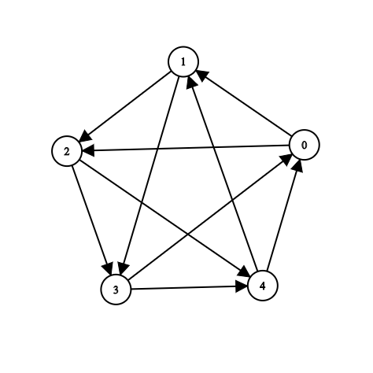
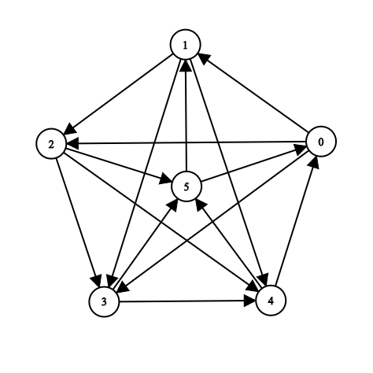
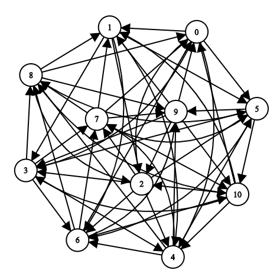

## Tournament-Graph-Generator
Tournament graph generator is C++ project to generate [tournament graphs](https://en.wikipedia.org/wiki/Tournament_(graph_theory)).

Input is the number of nodes through stdin, output is the list of nodes then the edges through stdout, this output can be viewed directly through [graph editor](https://csacademy.com/app/graph_editor/)

### Examples:

n=5

n=6

n=11

